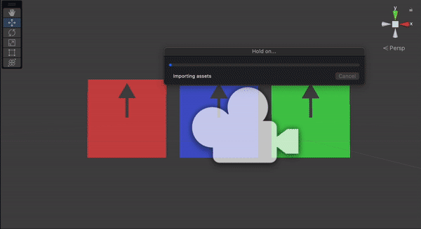

# Asynchronous
다음은 병렬실행과 관련있는 동기 & 비동기적 처리방식을 C#으로 구현하는 패러다임을 작성한 노트입니다.

일부 문서 한정으로 스타일링된 본인의 [블로그](https://felipuss.tistory.com/) 주소가 더 가독성에 도움이 되실것입니다.

<div align="center">
	
</div>

---

## 목차

* ### [ⓐ 동기적 비동기적 개요](./1_Async_개요.md)
  * [1 동기적 비동기적 블로그]()
    ```text

    ```

* ### [ⓑ C# Task](./2_Async_Task.md)
  * [2 C# Task 블로그]()
    ```text

    ```
* ### [ⓒ 코루틴](./3_Coroutine.md)
  * [3 코루틴 블로그]()
    ```text

    ```
* ### [ⓓ UniTask](./4_Async_UniTask.md)
  * [4 UniTask 블로그]()
    ```text

    ```

[비동기 코드들](./src)
 
### 참조