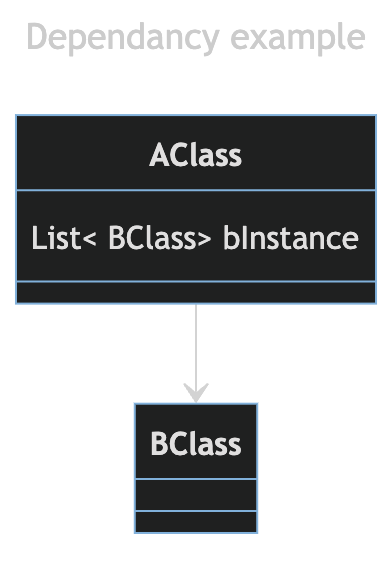

---
ebook:
  theme: one-dark.css
  title: 객체지향
  authors: Escatrgot
  disable-font-rescaling: true
  margin: [0.1, 0.1, 0.1, 0.1]
---
<style>
    h3.quest { font-weight: bold; border: 3px solid; color: #A0F !important;}
    .quest { font-weight: bold; color: #A0F !important;}

    h2 { border-top: 12px solid #86B049; border-left: 5px solid #86B049; border-right: 5px solid #86B049; background-color: #86B049; color: #FFF !important; font-weight: bold;}

    h3 { border-top: 3px solxwid #FFF; border: 2px solid #FFF; background-color: #FFF; color: #476930 !important;}

    h4 { font-weight: bold; color: #FFF !important; }
</style>

## &nbsp;♽ 0. Dependency Inversion

### 📄 1.  용어
#### 1). Dependency : 의존성이란?

> 한 클래스가 다른 클래스를 참조할때 의존성이 있다고 말할 수 있다. 

|A는 B에 의존적이다|Diagram|
|:--|:--|
|<ol><li>A가 B를 멤버로 가지고 있거나</li><li>A메소드에서 B를 패러미터로 이용하거나 리턴한다던지.</li><li>B의 메소드를 사용한다던지</li><li>어쨌든 A에서 B를 사용하면~</li></ol>||


#### 2). DIP (Dependency Inverse Principle)

<p align="center">
    </br>
    </br>
    좌 : DIP없이 의존한 관계, 우 : DIP를 적용해 추상적인 개념에 의존함
</p>

**ⓐ 의존 역전 원칙 이란?**
  
구체적인 타입에 직접 참조(의존)를 하는것이 아닌 추상적인 타입을 참조(의존)하자라는 것. 
(Depend upon abstractions, Do not depend on concrete)
1. 즉, 의존을 하더라도 구체적인(Concrete) 개념보단 [추상클래스 | Interface] 에 의존해야하는것
2. 변경, 확장, 수정 가능성이 큰 클래스로 부터 파생하지 말고, 추상적인 클래스로 부터 파생하여 확장성을 높이자.

**ⓑ Inversion 방법**

아니, 그렇다면.. 다른 클래스를 사용하고 싶을때 의존 관계를 맺지 않으면 어떤 방법이 있나?

클래스를 의존하지는 않지만, 사용하는 개념그것이 바로 **Inversion**
1. "포함관계, 사용관계" : **"관계 주입 (Dependency Injection)"** 을 이용해 사용함
    * 멤버변수에 [추상 클래스 |인터페이스]를 두고 
    * `생성자 함수`와 `Set` 함수를 이용해서 인자로 [싶은 클래스, 인터페이스]를 **"주입"** 받는다는 것이 이 원칙을 따르는 한 예일 것이다.
    * 이를 통해 컴포넌트간의 결합도를 낮추고, 테스트 용이성을 제공한다.
1. "상속관계" : 관계주입이 유일한 방법이 아니다.
    * 추상클래스 A는 추상적인 기반 메서드를 통해(Hook Method), "어떤 동작을 하는지 결정"하고, 그 동작이 어떤 시점으로, 순서로 작동하는지 결정한다.
    * 하위 클래스 B 는 Hook Method를 구체화(Override) 시켜 로직을 결정한다.
따라서 B는 A클래스에 구체화 관계로 의존하지만, A는 B가 어떻게 구현되어있는지 신경을 쓰지 않는다.


**ⓒ 예시**

**1. DIP_BAD 🤪**

|Diagram|Code|
|:-:|:-:|
|||

**2. DIP_GOOD 😎**
[추상 클래스 | 인터페이스] 전략 패턴과, 관계주입을 통해 DIP를 준수하면.
"ILogger 멤버"는 "ILloger를 구현하는 클래스(DatabaseLogger)"들과 상호 교체가 가능하다. 

|Diagram|Code|
|:-:|:-:|
|||

```java
class Person {
    private Pet pet;
    public Person(Pet pet){
        SetPet(pet)
    }
    public void SetPet(Pet pet){
        this.pet = pet;
    }
}
```

```java
abstract class A {
    public void foo(){
        bar();
        baz(); /*자식클래스가 정의*/
    }
    public void bar() {..};
    protected abstract void baz();
}

class B extends A {
    @Override
    protected void baz() {...}
}
```