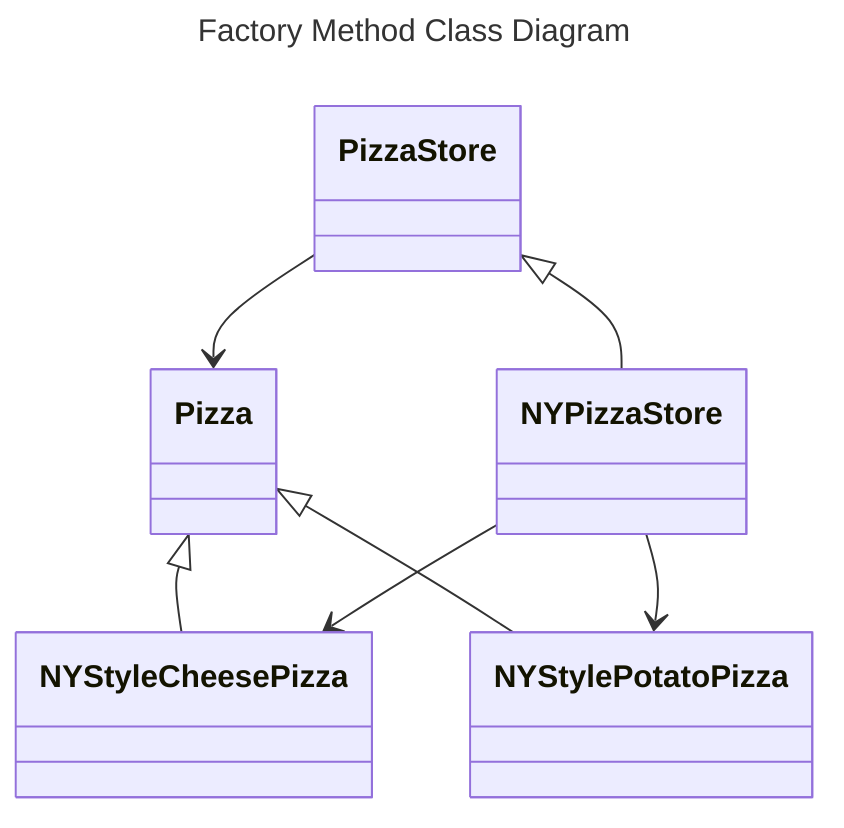

---
ebook:
  theme: one-dark.css
  title: 객체지향
  authors: Escatrgot
  disable-font-rescaling: true
  margin: [0.1, 0.1, 0.1, 0.1]
---
<style>
    h3.quest { font-weight: bold; border: 3px solid; color: #A0F !important;}
    .quest { font-weight: bold; color: #A5F !important;}
    h2 { border-top: 12px solid #D40; border-left: 5px solid #D40; border-right: 5px solid #D40; background-color: #D40; color: #FFF !important; font-weight: bold;}
    h3 { border-top: 12px solid #F90; border: 5px solid #F90; background-color: #F90; color: #FFF !important;}

    h4 { font-weight: bold; color: #FFF !important; }

    summary { cursor:pointer; font-weight:bold; color : #0F0 !important;}

    .red{color: #d93d3d;} 
    .darkred{color: #470909;} 
    .orange{color: #cf6d1d;} 
    .yellow{color: #DD3;} 
    .green{color: #25ba00;} 
    .blue{color: #169ae0;} 
    .pink{color: #d10fd1;} 
    .dim{color : #666666;} 
    .lime{color : #addb40;}

    .container {
        display : flex; 
        flex-direction:row;
        align-items:center;
    }
    .item {
        margin-right:2%;
    }

    @media screen and (min-width:1001px){
        .container {
            width: 90%;
            flex-wrap : nowrap;
            justify-content:center;
        }
    }
    
    @media screen and (max-width:1000px){
        .container {
            width: 98%;
            flex-wrap : nowrap;
            justify-content:center;
        }
    }
    
    @media screen and (max-width:799px){
        .container {
            justify-content:left;
            flex-wrap : wrap;
        }
    }
</style>


## 📄  4. 객체지향 디자인 패턴

#### Unity에서 알아두면 좋을 디자인패턴 그 확장편

### 📄 1. 생성 패턴

<div align="center">
  <h4> 생성과 참조과정을 캡슐화 하여 객체가 생성되거나 변경되도 <br>
  시스템에 영향을 크게 받지 않도록 프로그램의 유연성을 더해주는 패턴</h4>
</div>

---

#### 1). Simple Factory Method
> 단, 사실 디자인 패턴이라기 보단 
> ***Factory Method Pattern*** / ***Abstract Factory Pattern***의 Base가 되는 부분이다.

**ⓐ 특징**

다음과 같은 Simple Factory을 만들어서 얻는 이점.
1.  객체 생성을 Factory 역할을 하는 클래스에 위임하는것이 목표다. 
그래서, 곳곳에 퍼져있는 객체 생성의 책임을 한 모듈을 통해 관리한다는 점
1.  피자의 종류가 나중에 추가 혹은 변경(코드의 확장, 수정 변경이 자주 일어나는)되는 요소를 추상화함
다양한 팩토리를 상속, 확장의 용이성이 있다, 
1.  상속과 인터페이스 구현과 같이 다양한 서브타입을 생성할 수 있으므로 다형성의 이득을 볼 수 있다.

다만, 현재 구현 상황의 단점은..
1.  기반 클래스를 상속할지, 굳이 변경할 필요가 없는 부분 을 구별하지 못하브로
    쓸모 없는 클래스를 계속 구현해야하고, 그 로직 절차가 잘못 변경되는것을 막을 수 없다.
    그래서 변경에 고정시키기가 어렵다..?

* "*부모가 되는 Factory 클래스*"를 상속하는 "*자식 Factory 클래스를 만든다.*"

**ⓑ 사용하는 이유**
일반적인 객체를 생성할떄는 보통 new 연산자를 사용한다.

</details>

**ⓒ 구성요소**

* **Product** : 
    * 팩토리를 통해 생성이 되는 객체들의 **인터페이스 || 추상클래스** 
* **Concrete Product** :
    * Product를 구현하거나 상속받는 객체
    ProductType과 1대 1 대응하도록 클래스를 만들어 줘야한다.
* **Factory** :
    * Concrete Product를 리턴해주는 클래스
    `CreateProduct(ProductType type)`를 통해서 타입에 맞는 객체를 리턴한다.

**ⓓ 구현**

**다양한 피자를 생성하는 "Static Method" Java**
```java

/*********************************************************************************
* 다음과 같은 Static Method을 만들어서 얻는 이점.
*   1.  객체의 생성을 한 메소드에서 관리하게 되고, 
        따라서 피자 객체를 생성하는 곳을 한곳으로 관리하게 쉽게 할 수 있다.

* 다만, 현재 구현 상황의 단점은..
*   1.  일단 스트링 타입으로 받기 때문에, 오타의 오류가 있을것 & 문자열 비교의 비용이 큼
        -> Enum타입을 쓰면 어떨까? : EnumType의 폭발이 있을 가능성이 있음
    1.  상속기능이 불가능, 따라서 확장이 힘듦
*********************************************************************************/

public class PizzaStore {
    public class Pizza {
        public prepare(){}
        public bake(){}
        public cut(){}
        public box(){}

        public Pizza orderPizza(String type) {
            pizza = createPizza(type);
            pizza.prepare();
            pizza.bake();
            pizza.cut();
            pizza.box();
            return pizza;
        }
    }

    static public Pizza createPizza(String type) {
        switch(type) {
            Pizza pizza = null;
            case "cheese": 
            {
                pizza = new CheesePizza();
                break;
            }
            case "potato": 
            {
                pizza = new PotatoPizza();
                break;
            }
            case "pepperoni": 
            {
                pizza = new PepperoniPizza();
                break;
            }
            default { break;}
        }
        return pizza;
    }
}
```

**다양한 피자를 생성하는 "Simple Factory" Java**
|Code|Diagram|
|:--|:--|
|||

<details>
    <summary>📂 Simple Factory Pattern 예시 (C#) 📂</summary>

```cs
/*Product.cs*/
public abstract class ProductMob : MonoBehaviour{
    protected int mHp;
    public int HP {
        get { return mHp; }; 
        set {
            if(mHp - value < 0) {mHp = 0;}
            mHp = value;
        };
    }
    public void Move();
    public void Die();
    public void GetDamaged(int _amout);
}
```
```cs
/*ConcreteProducts.cs*/
public enum MobType {Raptor, RobUwa}

public class Raptor : ProductMob {
    public override void Move() { Debug.Log("음직인다!"); }
    public override void Die() { Debug.Log("죽었다!"); }
    public override void GetDamaged(int _amout) {
        this.HP -= _amount;
        Debug.Log("맞았다!");
        if(this.HP <= 0) {Die();}
    }
}
public class RobUwa : ProductMob {
    public override void Move() { Debug.Log("음직인다!"); }
    public override void Die() { Debug.Log("죽었다!"); }
    public override void GetDamaged(int _amout) {
        this.HP -= _amount;
        Debug.Log("맞았다!");
        if(this.HP <= 0) {Die();}
    }
}
```
```cs

/*Factory.cs*/
public class SimpleMobFactory {
    public static GameObject CreateMob(MobType type) {
        GameObject res = null;
        switch (type) 
        {
            case MobType.Raptor : 
            {
                res = Instantiate(Raptor);
                break;
            }
            case MobType.RobUwa : 
            {
                res = Instantiate(RobUwa);
                break;
            }
        }
        return res;
    }
}
```
```cs
/*MobGenerator.cs*/
using System.Collections;
using System.Collections.Generic;
using UnityEngine;

public class MobGenerator : MonoBehaviour {
    void Start () {
        ProductMob mob1 = SimpleMobFactory.CreateMob(MobType.Raptor);
        ProductMob mob2 = SimpleMobFactory.CreateMob(MobType.RobUwa);

        mob1.Move(); mob1.GetDamaged(10); 
        mob2.Move(); mob2.GetDamaged(15); 
    }
}
```

</details>

---

#### 2). Factory Method

**ⓐ 특징**
* 객체 생성 역할을 Factory 역할을 하는 클래스에 위임하는것이 목표다.
그래서 "**객체 생성을 Factory라는 한곳에서만 관리**"한다는점이 장점이라고 할 수 있겠다.
곳곳에 퍼져있는 객체 생성 코드... 하나로 통합하고 싶다면?

* 그리고 Simple Factory에서 *Open Closed Principle*을 개선한 패턴이다.
즉 변경이 없이(닫힘), 확장하기 쉬운(열려있는) 형식으로 개선 되었다.

Factory Method
* 기반(부모)클래스에 알려지지 않은 구체(자식)클래스를 생성하는 Template Method
* 팩토리 메서드의 반환 타입은 "생성되어 반환되는 객체가 구현하고 있는 인터페이스"다.
* 기반(부모)클래스 코드에 구체(자식) 클래스의 이름을 감추는 방법이다

*
    > 그래서 *[frontierdev (인터페이스로 프로그래밍하기 #깨지기 쉬운 기반 클래스 문제3)](https://frontierdev.tistory.com/58)* 님 왈, Factory Method가 부적절한 이름이라는 이야기를 했는데.
    > 사람들은 객체를 생성하는 모든 메소드를 자연스레 팩토리 메소드라 부르는 경향이 있다는 점에서 꼽았다.
    > 그래서 생성 매소드가 모두 팩토리 패턴을 사용하는것이 아니고,
    > **파생 클래스가 어떤 객체를 생성할지를 결정하도록 한다** 가 중요하다고 이야기 했고,
    > Tempate Method 패턴의 생성 패턴 버젼이라고 이야기했다.

교육 목표
Factory 메소드 패턴은 "외부 접근이 가능한 객체를 생성하는 메소드"를 정의해주지만
어떤 클래스의 인스턴스를 생성할지는 하위클래스들이 결정하도록 해주는 패턴이다.

객체 생성을 위한 추상적인 틀만 제공하고, 자식에서 구현하도록 위임한다.
필요한곳에서 그리고 쓸데없이 상속받을 메서드는 final로 고정

> 그래서 팩토리 클래스를 만들어서 사용하는것이 아니라 팩토리 역할을 하는 메소드를 Abstract로 만들고 아래에서 구현하도록 객체를 생성하는 메소드를 정의해주지만 어떤 클래스의 객체를 생성할지는 하위 클래스가 결정한다. 그렇게 하면 FactoryMethod를 가지는 Create클래스는 어떤 ConcreteCreator클래스가 사용될지 모르는 상태에서 작성이 가능하다는 점.

하나의 concrete creator만 존재하더라도 이득이 있는가?
* **객체의 사용과 생성을 분리해주기 때문에 여전히 이득임**

factory 메소드는 항상 추상 메소드인가?
* 아님. 기본 factory 메소드를 만들어 사용가능
* 추상 메소드일 경우 concrete creator는 반드시 factory 메소드를 정의해야 함. 생성의 모든 책임은 하위 클래스에 있음
* 반면에 기본 메소드를 제공할 경우
* 둘 다 concrete class가 되기 때문에 좋은 방법은 아님
* 물론 creator 클래스가 기본 메소드를 제공하면서 추상 클래스로 사용할 수 있지만 드문 형태임

factory 메소드는 인자에 따라 항상 여러 종류의 객체를 생성하도록 구현되나?
* 아님. 한 종류의 객체를 생성하는 경우도 많음

<details>
    <summary>📂 다양한 피자를 생성하는 "Factory Method" Java 📂</summary>

```java
/******************************************************
* DIP(의존 역전 원칙)을 잘 지킨 사례이다.
* 상위 수준 타입은 다른 상위 수준 타입에 의존하도록 하는것이 좋음
    Depend upon abstarctions.
* 상위 수준 타입이 하위 수준타입에 의존하지 않도록 하는것이 팔요함
    Do not depend on Concrete classes.

특히 DIP를 지키는 두가지 방법(DI, 상속)중 지금 Factory Method는 "상속"이다.

우리는 항상 String 객체를 생성하여 사용하고 있음

이 원리를 충실하게 적용하기 위해서는
*   new 대신에 객체를 생성하는 메소드를 이용
    * 추상 타입에 생성 객체를 유지해야 함
*   구체적(Concrete) 클래스를 상속하지 말아야 함.
    반대로 추상적인 클래스를 상속해야함 (추상 클래스, 인터페이스)
    * 구체적 클래스를 상속하면 구체적 클래스를 의존하는 형태임

*   부모 클래스의 추상 메소드가 아닌 것은 재정의하지 않아야 함
    * 재정의한다는 것은 모든 자식 클래스에서 공통으로 사용되지 않는다는 것을 의미함 (부모가 더 이상 abstraction이 아님 즉, Final로 하든지, 꺠지기 쉬운 구조로만 만들지 말자는것.)

* 위에 제시된 방법을 항상 지키는 것은 힘듦 하지만 왜 이와 같은 방법이 제시된 것인지 이해하고 사용해야 함

다음 예시는
부모클래스는 자식 클래스에 의존하지 않지만.. 
않고 있는데도 자식의 메소드를 사용한다.

******************************************************/

public abstarct class PizzaStore {
    public final Pizza orderPizza(String type){
        Pizza pizza = this.createPizza(type);
        /*피자를 생성하는 "로직 절차"*/
        return pizza;
    }
    public abstarct Pizza createPizza(String type);
}

public class NYPizzaStore extend PizzaStore {
    @Override
    public Pizza createPizza() {}
}
```



</details>

**ⓑ 구성요소**
<p align="center">
    
</p>

* **Product** : 
    * 팩토리를 통해 생성이 되는 객체들의 **인터페이스 || 추상클래스** 
* **Concrete Product** :
    * Product를 구현하거나 상속받는 객체
    ProductType과 1대 1 대응하도록 클래스를 만들어 줘야한다.
* **Factory|Creator** :
    * Concrete Product를 리턴해주는 클래스
    `CreateProduct(ProductType type)`를 통해서 타입에 맞는 객체를 리턴한다.
    * 이제 이 클래스는 추상 클래스로 정의 하는 방법도 있는데
    이 클래스를 상속받는 서브 클래스들의 Create 방식을 각각 다르게 정의해주는것을 명시할 수도 있다.
* **Concrete Factory|Concrete Creator** :
    * Factory|Creator를 상속 받아 Create해서 객체 생성 박식을 다르게 정의해주는 서브 클래스

**ⓒ 구현**
**ⓓ 예시**

#### 3). Abstract Factory
관련된 객체 군(family) 중 하나를 생성하도록 해주는 팩토리, 이떄 생성되는 객체의 구체타입은 인터페이스를 통해 가려진다.
구체 타입이 아닌 인터페이스를 통해 프로그래밍 하기 떄문이다.

교육 목표
Abstract Factory는 구체적인 클래스를 지정하지 않고, 서로 관계가 있는, 또는 의존하는 일련의 객체를 생성할 수 있는 인터페이스를 제공해준다.

---

### 📄 2. 구조 패턴

<div align="center">
  <h4>클래스나 객체를 조합하여 더 큰구조로 만드는 패턴 </h4>
</div>

---

#### 1). Adapter


**ⓐ 특징**
* 호환 되지 않는 인터페이스를 가진 객체들이 엽업하도록 다른 인터페이스를 변환 해줌

**ⓑ 왜 쓰는건가?**
> 누더기 기우는데 사용한다..

**ⓒ 구성요소**


**1. Client**
**2. Client Interface**

**ⓓ 구현**
**ⓔ 예시**

---

### 📄 3. 행동 패턴

<h4 align="center">
클래스와 객체간 서로 상호작용하는 방법이나 책임 분배 방법을 정의
하나의 객체로 수행할 수 없는작업을 여러 객체로 분해하면서 결합도를 낮출수 있음
</h4>

---

#### 1). Template Method


**ⓐ 특징**
```cs
class Animal {
    void Walk();
}
```

#### 2). Visitor

https://www.youtube.com/watch?v=QC8Q5MWB-mQ
https://www.youtube.com/watch?v=rbtyXGDL0eo

**ⓐ 특징**
데이터 구조와 데이터 처리를 분리해주는 패턴 데이터 구조는 Composite pattern을 사용함

**ⓑ 왜 쓰는건가?**
데이터 처리 방식을 기존의 소스코드 변경 없이 새로운 추가만으로 확장할 수 있음

**ⓒ 구성요소**
```
Client : 
Unit :interface 
데이터 구조를 나타냄
    item 단일 데이터를 나타내는 
    itemList : 유닛 데이터를 여러개 가질 수 있도록
Visitor : interface
    데이터 처리 메소드
```

**ⓓ 구현**
```cs
/*Unit.cs*/
public interface Unit {
    void Accept(Visitor visitor);
}

/*item.cs*/
public class Item : Unit{
    public int value {get; private set};

    public Item(int value) {this.value = value;}

    public override Accept(Visitor visitor) {visitor.visit(this);}
}

/*itemList.cs*/
public class ItemList : Unit{
    private List<Unit> list = new List<Unit>();

    public void Add(Unit unit) {list.Add(unit);}
    public void AddList(List<Unit> unit) {unit.Foreach(u => list.Add(u);)}

    public override Accept(Visitor visitor) {
        list.Foreach(u => visitor.visit(u));
    }
}

/*Visitor.cs*/
public interface Visitor {
    void Visit(Unit unit);
}

/*SumVisitor.cs*/
public class SumVisitor : Visitor {
    private int sum = 0;

    public int getValue() {return sum;}

    public override void Visit(Unit unit) {
        if(unit instanceof Item) {
            sum += (Item) unit.value;
        }
        else 
        {
            unit.Accept(this);
        }
    }
}

/*AvgVisitor.cs*/
public class AvgVisitor : Visitor {
    private int sum = 0;
    private int count = 0;

    public int getValue() {return sum / count;}

    public override void Visit(Unit unit) {
        if(unit instanceof Item) {
            sum += (Item) unit.value;
            count++;
        }
        else  {
            unit.Accept(this);
        }
    }
}

/*MainEntry*/ 
public class MainEntry {
    public static void main(string[] argc) {
        ItemList list1 = new ItemList();
        list1.add(new Item(10));
        list1.add(new Item(40));
        list1.add(new Item(30));
        
        ItemList list2 = new ItemList();
        list2.add(new Item(15));
        list2.add(new Item(55));
        list2.add(new Item(30));
        
        ItemList list3 = new ItemList();
        list3.Add(new Item(25);)
        list2.Add(list3);

        SumVisitor sum = new SumVisitor();
        list1.Accept(sum);

        AvgVisitor avg = new AvgVisitor();
        list2.Accept(avg)
    }
}
```

**ⓔ 예시**

### 📄 4. 디커플링 패턴


#### 1). Event Queue : Decoupling Patterns
> Decouple when a message or event is sent from when it is processed.
> "이벤트" "메세지를" 상호 교체하면서 사용할 예정.
> 새로운 메세지가 들어오더라도, 이전 메세지가 끝날때 까지 기다리기 위해 메세지 큐를 사용함.
> 시간과 디커플링하기 위해 사용

```cs
/*.cs*/

/*Client.cs*/

public static event System.Action<string> => OnFuelRunOut;

private UpdateMass(float dt) {
    ...
    if(lastMass > massNoFuel && (currentMass <= massNoFuel)) {
        OnFuelRunOut?.Invoke($"{rocketName} has run out of fuel");
    } 
    ...
}

/*MessageReceiver.cs*/
using TMPro;
public class MessagePanelBehaviour : MonoBehaviour {
    [SerializeField] private TextMeshProGUI messageDisplay;
    private float displayTime;
    private Queue<string> messages = new Queue<string>();

    private void OnEnable(){
        Client.OnFuelRunOut += RocketEngineBehaviour_OnFuelRunOut;
    }

    private void RocketEngineBehaviour_OnFuelRunOut(string obj) {
        message.Enqueu(obj);
    }

    private void OnDisable(){
        Client.OnFuelRunOut -= RocketEngineBehaviour_OnFuelRunOut;
    }

    private void Update() {
        CheckQueue();
    }

    private void CheckQueue() {
        if(/*Is Running*/) {return;}
        if(messages.Count > 0) {
            RocketEngineBehaviour_OnFuelRunOut(messages.Dequeue());
        }
    }
}
```

[이벤트큐 패턴 : (EventQueuePattern)](./src/Design/EventQueue/EventQueuePattern.cs)
[추상적인 의존 관계 클래스 : (SomeDependentService)](./src/Design/EventQueue/SomeDependentService.cs)
[이벤트 큐가 의존하는 커맨드 인터페이스 동물 (Icommand)](./src/Design/EventQueue/ICommand.cs)

### 참고

https://github.com/JoanStinson/UnityDesignPatternsReference