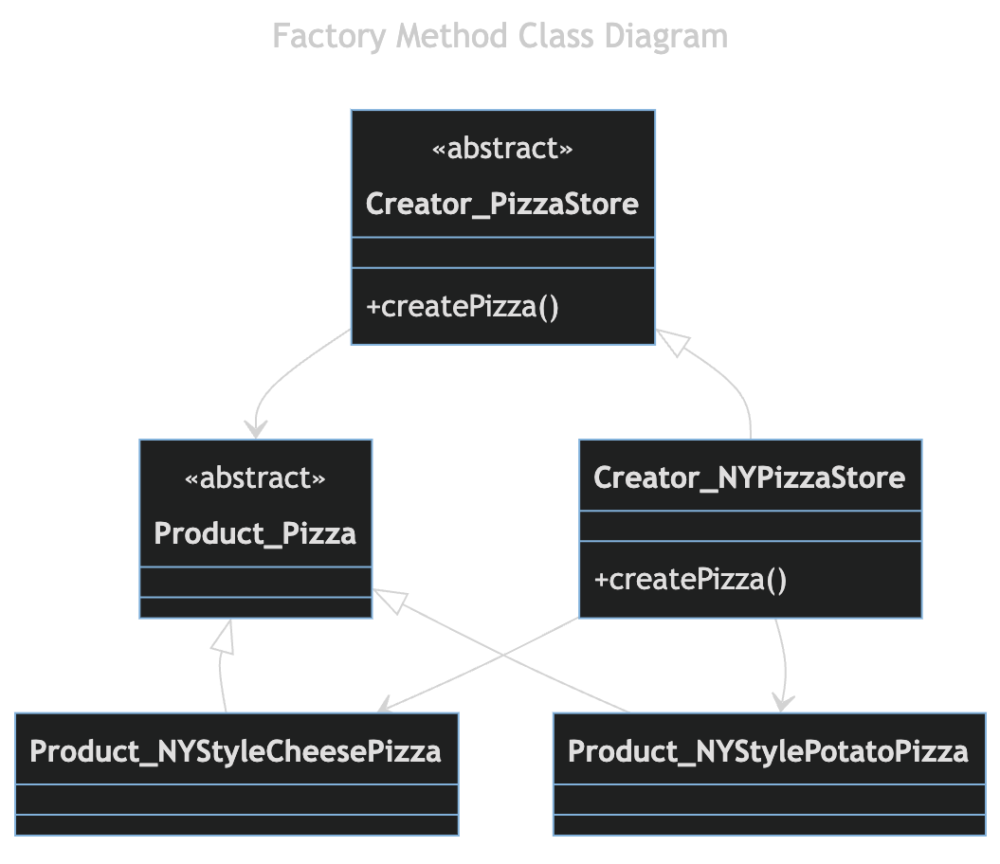
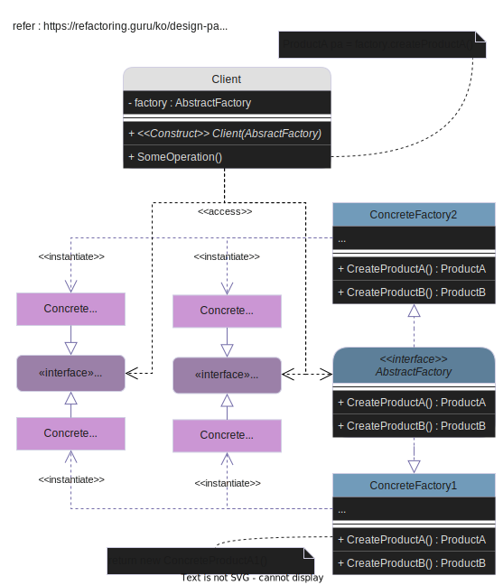

---
ebook:
  theme: one-dark.css
  title: 객체지향
  authors: Escatrgot
  disable-font-rescaling: true
  margin: [0.1, 0.1, 0.1, 0.1]
---
<style>
    h3.quest { font-weight: bold; border: 3px solid; color: #A0F !important;}
    .quest { font-weight: bold; color: #A5F !important;}
    h2 { border-top: 12px solid #D40; border-left: 5px solid #D40; border-right: 5px solid #D40; background-color: #D40; color: #FFF !important; font-weight: bold;}
    h3 { border-top: 12px solid #F90; border: 5px solid #F90; background-color: #F90; color: #FFF !important;}

    h4 { font-weight: bold; color: #FFF !important; }

    summary { cursor:pointer; font-weight:bold; color : #0F0 !important;}

    .red{color: #d93d3d;} 
    .darkred{color: #470909;} 
    .orange{color: #cf6d1d;} 
    .yellow{color: #DD3;} 
    .green{color: #25ba00;} 
    .blue{color: #169ae0;} 
    .pink{color: #d10fd1;} 
    .dim{color : #666666;} 
    .lime{color : #addb40;}

    .container {
        display : flex; 
        flex-direction:row;
        align-items:center;
    }
    .item {
        margin-right:2%;
    }

    @media screen and (min-width:1001px){
        .container {
            width: 90%;
            flex-wrap : nowrap;
            justify-content:center;
        }
    }
    
    @media screen and (max-width:1000px){
        .container {
            width: 98%;
            flex-wrap : nowrap;
            justify-content:center;
        }
    }
    
    @media screen and (max-width:799px){
        .container {
            justify-content:left;
            flex-wrap : wrap;
        }
    }
</style>


## 📄  4. 객체지향 디자인 패턴

#### Unity에서 알아두면 좋을 디자인패턴 그 확장편

### 📄 1. 생성 패턴

<div align="center">
  <h4> 생성과 참조과정을 캡슐화 하여 객체가 생성되거나 변경되도 <br>
  시스템에 영향을 크게 받지 않도록 프로그램의 유연성을 더해주는 패턴</h4>
</div>

---

#### 1). Simple Factory Method
> 단, 사실 디자인 패턴이라기 보단 
> ***Factory Method Pattern*** / ***Abstract Factory Pattern***의 Base가 되는 부분이다.

**ⓐ 특징**

다음과 같은 Simple Factory을 만들어서 얻는 이점.

1.  객체 생성을 Factory 역할을 하는 클래스에 위임하는것이 목표다. 그래서, 곳곳에 퍼져있는 객체 생성의 책임을 한 모듈을 통해 관리한다는 점
2.  피자의 종류가 나중에 추가 혹은 변경(코드의 확장, 수정 변경이 자주 일어나는)되는 요소를 추상화함 다양한 팩토리를 상속, 확장의 용이성이 있다, 
3.  상속과 인터페이스 구현과 같이 다양한 서브타입을 생성할 수 있으므로 다형성의 이득을 볼 수 있다.

**ⓑ 사용하는 이유**
일반적인 객체를 생성할때는 보통 new 연산자를 사용한다.

**ⓒ 구성요소**

* **Product** : 
    * 팩토리를 통해 생성이 되는 객체들의 **인터페이스 || 추상클래스** 
* **Concrete Product** :
    * Product를 구현하거나 상속받는 객체
    ProductType과 1대 1 대응하도록 클래스를 만들어 줘야한다.
* **Factory** :
    * Concrete Product를 리턴해주는 클래스
    `CreateProduct(ProductType type)`를 통해서 타입에 맞는 객체를 리턴한다.

**ⓓ 구현**

**다양한 피자를 생성하는 "Static Method" Java**
```java

/*********************************************************************************
* 다음과 같은 Static Method을 만들어서 얻는 이점.
*   1.  객체의 생성을 한 메소드에서 관리하게 되고, 
        따라서 피자 객체를 생성하는 곳을 한곳으로 관리하게 쉽게 할 수 있다.

* 다만, 현재 구현 상황의 단점은..
*   1.  일단 스트링 타입으로 받기 때문에, 오타의 오류가 있을것 & 문자열 비교의 비용이 큼
        -> Enum타입을 쓰면 어떨까? : EnumType의 폭발이 있을 가능성이 있음
    1.  상속기능이 불가능, 따라서 확장이 힘듦
*********************************************************************************/

public class PizzaStore {
    public class Pizza {
        public prepare(){}
        public bake(){}
        public cut(){}
        public box(){}

        public Pizza orderPizza(String type) {
            pizza = createPizza(type);
            pizza.prepare();
            pizza.bake();
            pizza.cut();
            pizza.box();
            return pizza;
        }
    }

    static public Pizza createPizza(String type) {
        switch(type) {
            Pizza pizza = null;
            case "cheese": 
            {
                pizza = new CheesePizza();
                break;
            }
            case "potato": 
            {
                pizza = new PotatoPizza();
                break;
            }
            case "pepperoni": 
            {
                pizza = new PepperoniPizza();
                break;
            }
            default { break;}
        }
        return pizza;
    }
}
```

**다양한 피자를 생성하는 "Simple Factory" Java**
|Code|Diagram|
|:--|:--|
|||

**몬스터를 생성하는 "Simple Factory" Cs**
```cs
/*Product.cs*/
public abstract class ProductMob : MonoBehaviour{
    protected int mHp;
    public int HP {
        get { return mHp; }; 
        set {
            if(mHp - value < 0) {mHp = 0;}
            mHp = value;
        };
    }
    public void Move();
    public void Die();
    public void GetDamaged(int _amout);
}
```
```cs
/*ConcreteProducts.cs*/
public enum MobType {Raptor, RobUwa}

public class Raptor : ProductMob {
    public override void Move() { Debug.Log("음직인다!"); }
    public override void Die() { Debug.Log("죽었다!"); }
    public override void GetDamaged(int _amout) {
        this.HP -= _amount;
        Debug.Log("맞았다!");
        if(this.HP <= 0) {Die();}
    }
}
public class RobUwa : ProductMob {
    public override void Move() { Debug.Log("음직인다!"); }
    public override void Die() { Debug.Log("죽었다!"); }
    public override void GetDamaged(int _amout) {
        this.HP -= _amount;
        Debug.Log("맞았다!");
        if(this.HP <= 0) {Die();}
    }
}
```
```cs

/*Factory.cs*/
public class SimpleMobFactory {
    public static GameObject CreateMob(MobType type) {
        GameObject res = null;
        switch (type) 
        {
            case MobType.Raptor : 
            {
                res = Instantiate(Raptor);
                break;
            }
            case MobType.RobUwa : 
            {
                res = Instantiate(RobUwa);
                break;
            }
        }
        return res;
    }
}
```
```cs
/*MobGenerator.cs*/
using System.Collections;
using System.Collections.Generic;
using UnityEngine;

public class MobGenerator : MonoBehaviour {
    void Start () {
        ProductMob mob1 = SimpleMobFactory.CreateMob(MobType.Raptor);
        ProductMob mob2 = SimpleMobFactory.CreateMob(MobType.RobUwa);

        mob1.Move(); mob1.GetDamaged(10); 
        mob2.Move(); mob2.GetDamaged(15); 
    }
}
```

---

#### 2). Factory Method
**ⓐ 특징**

1. 이 패턴은 객체 생성을 Creator라는 한곳에서만 관리하도록 하고
2. "외부 접근이 가능한 객체를 생성하는 메소드" `Creator.CreateProduct()`를 제공한다.
3. 객체의 생성을 사용과 분리함으로, 생성할 객체의 타입을 나중에 결정할 수 있게 해주고
4. 어떤 클래스의 인스턴스를 생성할지는 하위클래스들이 결정하도록 해주는 패턴이다.
5. Simple Factory에서 DIP원칙을 지키고 OCP을 개선한 패턴이다.

**ⓑ 구성요소**

<p align="center">
    
</p>

* **Product** : 
    * 팩토리를 통해 생성이 되는 객체들의 **인터페이스 || 추상클래스** 

* **Concrete Product** :
    * Product를 구현하거나 상속받는 서브타입 객체

* **Factory|Creator** :
    * Product **[인터페이스 || 추상클래스]** 라는 상위 수준 타입에 의존하고 있고, 
    구체화된 ConcreteProduct를 몰라도 된다.
    * 두번째로 객체 생성을 위한 추상적인 틀만 제공하고, 자식에서 구현하도록 위임한다.
        ```
        그렇게 하면 FactoryMethod를 가지는 Create클래스는 
        어떤 ConcreteCreator클래스가 사용될지 모르는 상태에서 작성이 가능하다.
        
        객체 생성을 위한 abstract Product CreateProduct(ProductType type)를 통해서 
        타입에 맞는 객체를 리턴한다. 
        그리고 이 메서드는 ConcreteCreator에서 구체화 되도록 하여 
        자식 메소드를 사용하는 꼴로 만들어야 한다.
        
        단, 추상 메소드가 아닌것은 재정의 하지 않아야 한다. 
        쓸데없이 상속받을 메서드는 final로 고정함으로 꺠지기 쉬운 기반클래스 구조를 막아야 한다.
        ```
* **Concrete Factory|Creator** :
    * Factory|Creator를 상속 받아 Create해서 객체 생성 방식을 구체화 한 서브타입 객체들
    * ConcreteCreator는 Creator에 상속관계로 의존적이지만. Creator는 ConcreteCreator에서 구체화된 생성 메소드를 몰라도 된다.


**ⓒ 구현**

다음 예시는 부모클래스는 자식 클래스에 의존하지 않고 있는데도 자식의 메소드를 사용한다.

|Diagram|Code|
|:-:|:-:|
|||

Switch Case를 개선해보기

```java
/*이건 Simple Factory 기법이다.*/
class FruitFactory {
    public static Fruit createApple(/* parameters */){}
    public static Fruit createBanana(/* parameters */){}
    public static Fruit createMelon(/* parameters */){}
}
```

```java
/*Fruit.java*/
class abstract Fruit {
    string Name;
    image icon;
    public final void Display() { /* display logic */}
}

class Apple extends Fruit {}

/*FruitFactory.java*/
class abstract FruitFactory {
    public final static Fruit createFruit(/* parameters */) {
        Fruit fruit = createSpecificFruit(s); 
        return fruit;
    }

    protected abstract Fruit createSpecificFruit(/* parameters */);
}

class AppleFactory extends FruitFactory {
    @Override
    protected Fruit createSpecificFruit(/* parameters */) {
        Apple apple = new Apple(/* parameters */)
    }
}
```

**ⓓ 예시**
Asteroid 게임 : 소행성을 생성하는 부분을 팩토리 메서드 패턴을 이용해 구현한다.

---


#### 3). Abstract Factory

**ⓐ 특징**

> Thre Abstract Factory Provides an interface for creatring families of related
> dependent objects without specifying their concrete classes

비슷한 기능을 하는 요소지만, 테마나, 조금 다른 형태를 지는 변경된 것들을 사용하고 싶을때, 그런것들을 만드는 녀석

객체들이 어떻게 생성되는지 클라이언트로부터 추상화 하기 위해
1. 응용이 여러 객체 집합들중 하나로 구성되야 할때
2. 객체가 집합으로 생성되어야 할때. (families of related)

Factory 메서드는 상속을 통해 객체를 생성하는 반면, Abstract Factory는 상속보다는 Has-A 관계를 이용해 객체를 생성

장점 
1. 구현시 구체적인 객체 생성은 나중에 미룰 수 있음
2. 실행 시간에도 쉽게 객체 생성 집합을 바꿀 수 있음
3. SRP를 만족하기 쉬운 구조다.

단점
1. 새로운 종류의 Product를 지원해야 하면 클래스 갯수가 늘어난다.


<div align=center>
    
    <h5>행 : 제품 패밀리(Family) / 열 : 그들의 변형</h5> 
</div>

**ⓑ 구성요소**

<div align=center>
    
</div>

* **Abstract Product (Interface)** :
    * "일관적인 관계가 있는 객체들(families of related)" 에 대한 인터페이스
    * 예를 들어 `의자, 책상, 소파` 

* **Concrete Products** : 
    * 변형이 있는 구체적인 객체들
    * 예를 들어 `아르데코, 모던, 빅토리안`

<div align=center>
    
</div>

* **Abstract Factory (Interface)** : 
    * 추상 팩토리는 "families of related" 를 생성할 수 있는 인터페이스고 
    (Abstract Factory Provides an interface for creatring families of related),
    * "families of related"각각 개별 것들(Chair, Sofa, Table..)을 생성하는 메서드를 전부 목록화 한 인터페이스다.
   
* **Concrete Factory** : 
    * 추상 팩토리를 구체화 시켜, "변형이 있는 구체적인 객체"들을 생성하는 팩토리를 만든다.

<div align=center>
    
</div>

* **Client** :
    * 클라이언트는 위의 Product든, Factory든, 구체적인 클래스에 대해 의존하지 않는다. (dependent objects without specifying their concrete classes)
    * 따라서 작업하는 팩토리의 구체 클래스에대해 신경 쓰지 않아도 되고, 알필요도 없다
    * 구체 타입이 아닌 인터페이스를 통해 프로그래밍

---

### 📄 2. 구조 패턴

<div align="center">
  <h4>클래스나 객체를 조합하여 더 큰구조로 만드는 패턴 </h4>
</div>

---

### 📄 3. 행동 패턴

<h4 align="center">
클래스와 객체간 서로 상호작용하는 방법이나 책임 분배 방법을 정의
하나의 객체로 수행할 수 없는작업을 여러 객체로 분해하면서 결합도를 낮출수 있음
</h4>

---

#### 1). Visitor

**ⓐ 특징**
데이터 구조와 데이터 처리를 분리해주는 패턴 데이터 구조는 Composite pattern을 사용함

**ⓑ 왜 쓰는건가?**
데이터 처리 방식을 기존의 소스코드 변경 없이 새로운 추가만으로 확장할 수 있음

**ⓒ 구성요소**
```
Client : 
Unit :interface 
데이터 구조를 나타냄
    item 단일 데이터를 나타내는 
    itemList : 유닛 데이터를 여러개 가질 수 있도록
Visitor : interface
    데이터 처리 메소드
```

**ⓓ 구현**
```cs
/*Unit.cs*/
public interface Unit {
    void Accept(Visitor visitor);
}

/*item.cs*/
public class Item : Unit{
    public int value {get; private set};

    public Item(int value) {this.value = value;}

    public override Accept(Visitor visitor) {visitor.visit(this);}
}

/*itemList.cs*/
public class ItemList : Unit{
    private List<Unit> list = new List<Unit>();

    public void Add(Unit unit) {list.Add(unit);}
    public void AddList(List<Unit> unit) {unit.Foreach(u => list.Add(u);)}

    public override Accept(Visitor visitor) {
        list.Foreach(u => visitor.visit(u));
    }
}

/*Visitor.cs*/
public interface Visitor {
    void Visit(Unit unit);
}

/*SumVisitor.cs*/
public class SumVisitor : Visitor {
    private int sum = 0;

    public int getValue() {return sum;}

    public override void Visit(Unit unit) {
        if(unit instanceof Item) {
            sum += (Item) unit.value;
        }
        else 
        {
            unit.Accept(this);
        }
    }
}

/*AvgVisitor.cs*/
public class AvgVisitor : Visitor {
    private int sum = 0;
    private int count = 0;

    public int getValue() {return sum / count;}

    public override void Visit(Unit unit) {
        if(unit instanceof Item) {
            sum += (Item) unit.value;
            count++;
        }
        else  {
            unit.Accept(this);
        }
    }
}

/*MainEntry.cs*/ 
public class MainEntry {
    public static void main(string[] argc) {
        ItemList list1 = new ItemList();
        list1.add(new Item(10));
        list1.add(new Item(40));
        list1.add(new Item(30));
        
        ItemList list2 = new ItemList();
        list2.add(new Item(15));
        list2.add(new Item(55));
        list2.add(new Item(30));
        
        ItemList list3 = new ItemList();
        list3.Add(new Item(25);)
        list2.Add(list3);

        SumVisitor sum = new SumVisitor();
        list1.Accept(sum);

        AvgVisitor avg = new AvgVisitor();
        list2.Accept(avg)
    }
}
```

**ⓔ 예시**

### 📄 4. 디커플링 패턴


#### 1). Event Queue : Decoupling Patterns
> Decouple when a message or event is sent from when it is processed.
> "이벤트" "메세지를" 상호 교체하면서 사용할 예정.
> 새로운 메세지가 들어오더라도, 이전 메세지가 끝날때 까지 기다리기 위해 메세지 큐를 사용함.
> 시간과 디커플링하기 위해 사용

```cs
/*Client.cs*/

public static event System.Action<string> => OnFuelRunOut;

private UpdateMass(float dt) {
    ...
    if(lastMass > massNoFuel && (currentMass <= massNoFuel)) {
        OnFuelRunOut?.Invoke($"{rocketName} has run out of fuel");
    } 
    ...
}

/*MessageReceiver.cs*/
using TMPro;
public class MessagePanelBehaviour : MonoBehaviour {
    [SerializeField] private TextMeshProGUI messageDisplay;
    private float displayTime;
    private Queue<string> messages = new Queue<string>();

    private void OnEnable(){
        Client.OnFuelRunOut += RocketEngineBehaviour_OnFuelRunOut;
    }

    private void RocketEngineBehaviour_OnFuelRunOut(string obj) {
        message.Enqueu(obj);
    }

    private void OnDisable(){
        Client.OnFuelRunOut -= RocketEngineBehaviour_OnFuelRunOut;
    }

    private void Update() {
        CheckQueue();
    }

    private void CheckQueue() {
        if(/*Is Running*/) {return;}
        if(messages.Count > 0) {
            RocketEngineBehaviour_OnFuelRunOut(messages.Dequeue());
        }
    }
}
```

[이벤트큐 패턴 : (EventQueuePattern)](./src/Design/EventQueue/EventQueuePattern.cs)
[추상적인 의존 관계 클래스 : (SomeDependentService)](./src/Design/EventQueue/SomeDependentService.cs)
[이벤트 큐가 의존하는 커맨드 인터페이스 동물 (Icommand)](./src/Design/EventQueue/ICommand.cs)

### 참고


https://www.youtube.com/watch?v=QC8Q5MWB-mQ

https://www.youtube.com/watch?v=rbtyXGDL0eo

https://refactoring.guru/ko/design-patterns/abstract-factory

https://www.youtube.com/watch?v=gqRxK2A3Upg&list=PLsIth_qcusf_4DcL2C8GzkS5sz5TeW38q&index=22

https://github.com/JoanStinson/UnityDesignPatternsReference