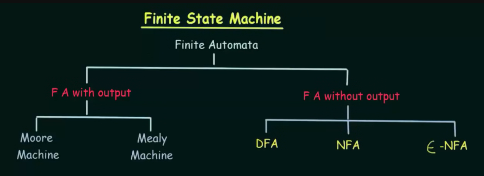
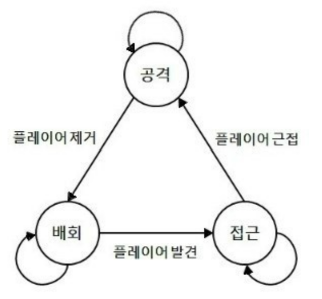
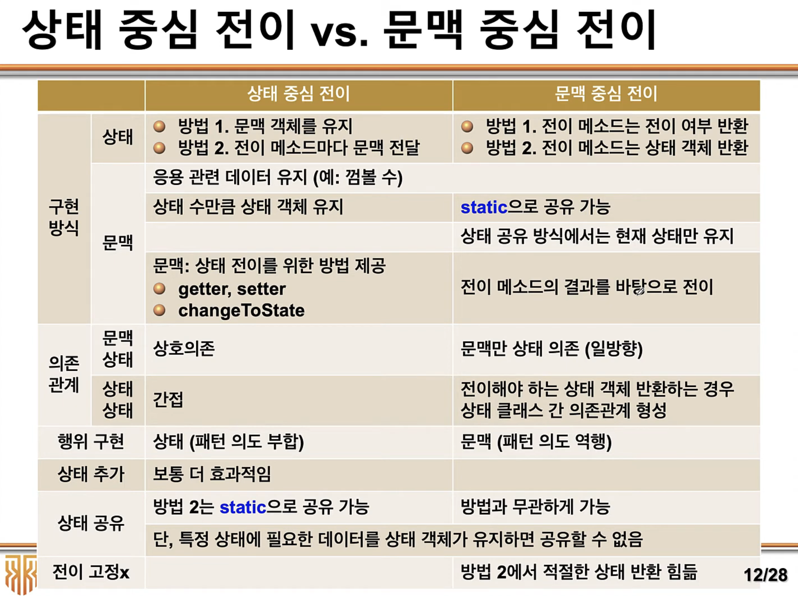

---
ebook:
  theme: github-light.css
  title: 객체지향
  authors: Escatrgot
  disable-font-rescaling: true
  margin: [0.1, 0.1, 0.1, 0.1]
---

---

## 🧮 FSM : 유한상태기계

---

### 📄 1. DFA
#### 1). 정의
> #### 결정적 유한 오토마타 (Determinstic Finite Automata) 5개로 구성된 튜플이다.

#### 2. 특징
* next state가 단 하나로 결정됨
* ε (empty input)에 대한 전이가 없음

#### 3). 수식

**${M = (Q, ∑, ∂, q0, F)}$**

1. Q : set of **state**
   * 노드, 상태를 의미
   * 인풋으로 들어가는 상태는 원소 하나일수도, 원소의 집합일 수 있다.
  
2. ∑ : set of symbols called **input** 
   * 간선(화살표), 전이함수의 인풋 매개변수로 사용

3. ∂ : 전이 함수 
   * ∂(상태, 인풋) -> 상태

4. q0 : inital state 
   * 초기 상태 *상태이므로 Q원소이다.*
   * 표현 방법은 1. 함수결과식 2. 상태 전이표
5. F : final state
   * 엔딩 상태이다.

---

### 📄 2. 스트립팅
#### 1. 기본 개념

|img|설명|
|:--|:--|
|  | <ul> <li>**Q** = {공격, 배회, 접근}</li> <li> **∑** = {<i>플레이어제거, 플레이어근접, 플레이어발견</i>}</li> <li> **∂(공격, <i>플레이어제거</i>}** = 배회  **∂(배회, <i>플레이어발견</i>}** = 접근  **∂(접근, <i>플레이어근접</i>}** = 공격</li></ul>|

0. `Context` : 상테에 따라 행동을 취하는 그 행동의 주체 *[ 객체 ]*
    * 다만, 상태에 따른 구체적인 행동을 상태에게 위임을 하게 된다/

1. `상태(State)` : Q 에 해당하는것 *[ 객체 ]*
    1. 유한개의 `상태`에 따라 다른 행동을 취하는 모델 
    2. 객체의 행동을 `상태`라는 클래스 로 분리한것
    3. 임의의 주어진 시간에 오직 한번에 한가지의 `상태`를 Activate하게 된다..
    4. 상태전이 함수(handle) 를 추상화한다.

2. `상태 전이(Transition)` : ∂ 에 해당하는것 *[ 함수 ]*
   * 현재 상태를 다른 상태로 변화 되는것
   * 상태 전이 규칙과, 시점의 기술이 중요 객체 내부에 있음

3. `이벤트` : ∑ 에 해당하는것 *[ 인풋(규칙과, 시점) ]*
   * 상태 전이를 위한 조건
   * 상태를을 전환하는데 규칙을 별도로 구현하기 때문에
   * 상태를 전환하는 시점과 규칙을 의미.

> #### 이 이론들을 도입한것이 바로 State Pattern

#### 2. 왜 쓰는가?
1. 오류 수정과 테스팅에 용이하다. 
2. 코드가 직관적 확장 변경에 용이하다.
    * 기존 switch case보단
    * 캡슐화 
        1. State 객체를 캡슐화 하고, 
        2. 상태전이와 로직을 실행하는 객체도 캡슐화, 
        3. Context 객체외 State를 분리함.
3. 기획의 용이성 : 상태 다이어그램을 통해 

---

### 📄 3. Deep Dive

Behaviour Medeling을 하는 이유
객체의 행위가 현재 상태에 따라 변화가 필요한 경우

|Behaviour Modeling|특징|
|:--|:--|
**1. switch-case**|가장 기초적인 상태에 따른 행동을 정의하는것, 단점은   1. 행동의 주체(Context)와 상태(State)가 분리되지 않아. 확장성이 낮고,  2. 상태가 많아지면 복잡해지는 비직관적이라는 문제가 있다.
|**2. state pattern**|객체의 여러 연산이 객체 상태에 의존하는 다중 조건문으로 구성된 경우   1. 상태(State)중심전이 : 상태라는 객체에 전이에 대한 규칙이 기술됨.  2. 문맥(Context)중심전이 : 상태는 전이의 유무만을 리턴하고, 전이에 대한 규칙은 Context에 정의됨, Context에 조건문을 작성하다보니. SRP 정도가 좀 낮다.   새 상태 클래스를 정의하여 새로운 상태를 쉽게 추가할 수 있음 상태 전이가 명백해짐  (각 상태가 다른 클래스로 모델링 되기 때문) 다만, 클래스가 매우 많아질 수 있음 (상태마다 하나)   
  
   사용할 수 있는 테크닉으로는 Singleton State가 있다.    1. **Singleton State** :   new delete를 반복적으로 일으키므로 State마다 싱글톤 패턴을 적용시키면 오버헤드와 메모리 낭비를 막을 수 있다. 다만, State의 생성이 멀티스레드에서 일어나지 않는것이 보장되야 하고, Singleton State내부에 공유되는 데이터가 없어야 하겠다. 그리고 State간 결합도가 높아질것.|
|**3. Finite State Machine**|Context내의 상태 전이에 대한로직 조차도 캡슐화 함 따라서 Context와 StateMachine으로 분리가 됨,   State에서는 Context가 가지는 모든 로직을 구체화 해야하는데. FSM에서는 전이가 되지 않는 쓸데없는 로직을 정의하지 않아도 되고, Enter, Execute, Exit과 같은 단계로 정의하게 됨 다만 단점은 상태가 증가할 수록 상태 전이의 서순이 매우 복잡해질 수 있다. 따라서 다음 두가지 정도로 해결 가능한데.   1. **전역상태와 상태 블립** :  전역상태 : 어느 상태에서도 발생할 수 있는 상태 전이  기본상태 : 일반적인 Context에서 실행되는.  상태블립 : 이전 상태를 저장해, 특정 조건에 따라 돌아가는것을 상태 블립이다.   2. **HFSM** : 상태 내부에 계층적인 로직이 내포된 모델|
|**4. HFSM (Hierarchy Finite State Machine)**|각 상태마다 지닌 로직을 통해 다음 상태로 전이하지만. 하위 상태가 있다.|
|**5. Behavior Tree**| HFSM을 개선 시킨것. 상위 노드에서 매 틱마다 우선순위를 평가하고 상태를 결정합니다.|

---

### 📄 참고
1. [FSM](https://m.blog.naver.com/PostView.naver?isHttpsRedirect=true&blogId=jerrypoiu&logNo=221235988023)
2. https://neulsang-day.tistory.com/30
3. [고박사](https://www.youtube.com/watch?v=O_NJaHpbjaI&t=15s)
4. [곰돌 : 애니메이터를 이용한 FSM](https://www.youtube.com/watch?v=MowE3moQ_Cw&t=3s)
5. [백준](https://www.acmicpc.net/problem/1013)
6. [iHeartGameDev](https://www.youtube.com/watch?v=Vt8aZDPzRjI&list=PLwyUzJb_FNeTR1Q7edAQuWkTKo_Ncq9ck)
7. [객체지향 개발론 실습 : 한기대 김상진 교수님](https://www.youtube.com/playlist?list=PLsIth_qcusf_4DcL2C8GzkS5sz5TeW38q)
8. [Game AI : 동서대 이동훈 교수님](https://www.youtube.com/watch?v=6ertJJh7S8o&list=PLyuV91SJJre5HxlKXJow6gBCVWNXBwULi)
