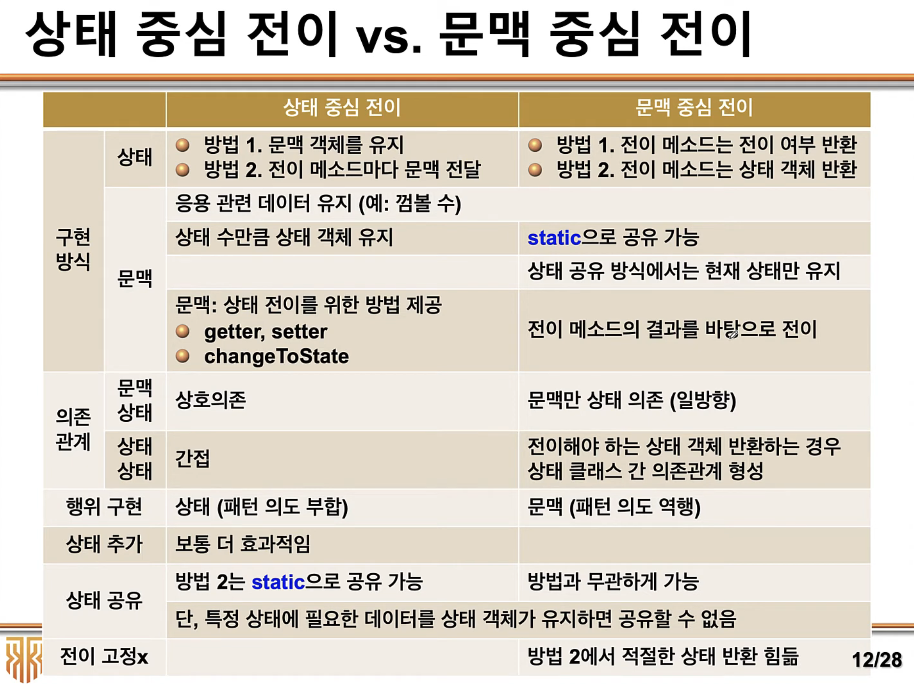

* **Context** : 
    * request는 원래 Context가 해야할 일이지만.
    * 그 행위를 모두 State에 위임하는 방식
* **State** : 
    * 상태는 인터페이스, 추상클래스 그리고 이걸 상속해서 구체화 한다.
* **ConcreteState** : 
    * State를 구체화 한것

상태중심 전이 StateDriven
문맥중심 전이 ContextDriven

적용 가능 시나리오
* 객체의 행위가 현재 상태에 따라 변화가 필요한 경우
* 객체의 여러 연산이 객체 상태에 의존하는 다중 조건문으로 구성된 경우

장단점
* 새 상태 클래스를 정의하여 새로운 상태를 쉽게 추가할 수 있음
* 상태 전이가 명백해짐 (각 상태가 다른 클래스로 모델링 되기 때문)
* 클래스가 매우 많아질 수 있음 (상태마다 하나)