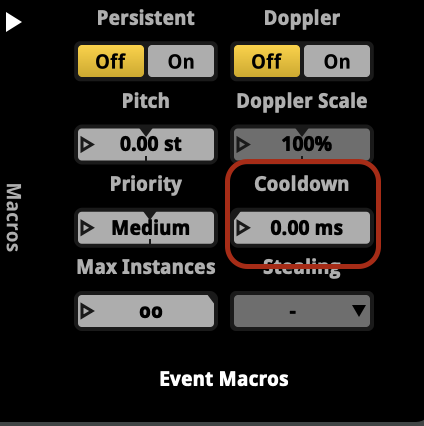
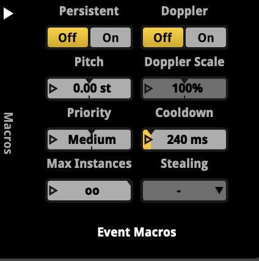
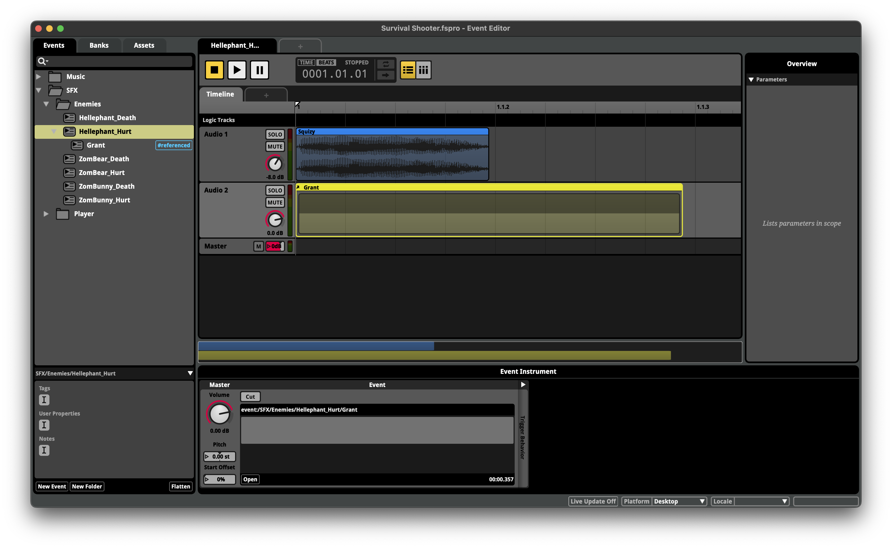

#### 1). 이벤트 쿨타임

    
    

1. 0.0ms 초로 설정되어 있다면 맞을떄마다 계속 이벤트를 튕긴다
2. 2.4ms 초로 두면 코루틴 효과 가능

---

#### 2). 이벤트 인스트로먼트
이벤트 사운드 
다른 레이어

    
    

---

#### 4). Mixer SnapShot

https://www.youtube.com/watch?v=UXWUe1Kpsnw