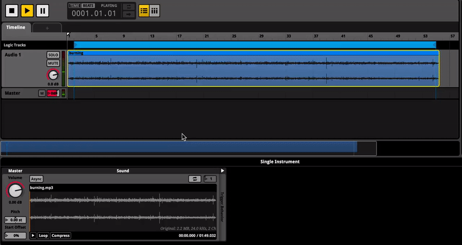

	
🔻관련 유튜브를 보려면 사진 클릭🔻

    <iframe width="560" height="315" src="https://www.youtube.com/embed/eJEpNmpy7Uo?si=fckZFBNPbLvIppqR" title="YouTube video player" frameborder="0" allow="accelerometer; autoplay; clipboard-write; encrypted-media; gyroscope; picture-in-picture; web-share" allowfullscreen></iframe>
	
	<h4>How to use Fmod - Start Offset</h4>

