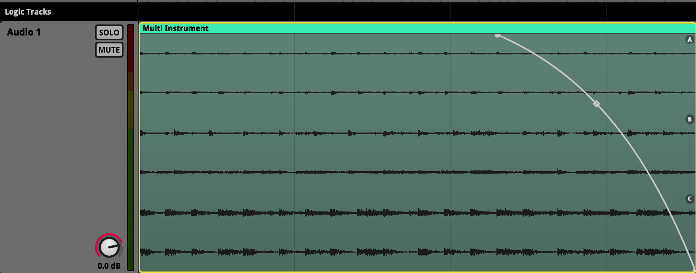

<h1 align="center"> Fmod </h1>

---

## 개요

* 동적인 음악 협업을 위한 툴

---

### 📄 1. FMOD?

1. DSP 사운드 이벤트
2. 유니티의 오디오 엔진을 대체할 수 있다.

3. 사운드 블랜드
4. 로직 컨트롤

배경음악을 구성하는 종류

Vertical Adaptive
* 동시에 음악을 재생하고
* 볼륨을 크로스 페이드

Horizontal Adaptive
* 전환하고자하는 음악 A B 
* 변경할 떄 템포에 맞춰 스팅어(Stinger)를 통해 전환되는 시점의 어색한 부분을 가려
  * 재생중인 음악에 겹쳐서 믹싱되게 함
  * 자연스럽게 전환 하게 한다.

---

### 📄 2. FMOD Integrate

bank란?
빌드란?
이벤트란?


1. 뎀포 바꾸기
2. 루프 구간
3. option shipt s : 그리드
4. 이벤트를 데이터 영역으로 뱅크
---

1. 유니티에 가서 FMOD 세팅
2. 카메라 소리 없에기
3. 뱅크를 통해 연결

뱅크 빌드는 다음과 같다.


---

### 📄 FMOD Project
#### 개요
1. 폴더채로 공유하면 된다.
2. AutoSave가 없으므로 꼮 주의하다.

#### UI

이벤트
   * 게임속 이벤트랑 1대1 매칭이 된다.
   * 뱅크에 Assign되야 의미가 있다.

뱅크
   * 이벤트를 종류별로 모아 담는다
   * 게임에 여러 리소스가 올라갈떄 뱅크 단위로 올라간다.

에셋
   * 리소스가 담딤

#### 오디오 트랙 & 타임라인
1. 패러미터
   *  오토메이션 가능
2. Deck 
   * 이펙트넣을 수 있음
3. 3D Preview

#### 오디오 임포트
1. 에셋에서 임포트

#### FADE 기능
 

#### 리젼
1. 오토메이션
   * 
2. LFO
   * 
3. loop
   * 
   * 
4. Async
   * 마커를 통해 헌번 트리거 되기만해도 계속 진행되도록

#### 파라메터
알파요 오메가다.
패러미터를 짜는 생각을 잘하자.

라우터 추가하기

분위기 바꾸기
|일반|전투|
|:--|:--|
|||


#### 오디오 추가하기


#### 스냅샷 이벤트

AHDSR


---

### 참고
https://www.youtube.com/watch?v=6QjjB2sRKBE&list=PLrJD7pzELsiY8FXY3edclUxbnFNCSr1Ep&index=3

https://davisan.itch.io/dvn-effects-fmod

https://www.youtube.com/watch?v=rcBHIOjZDpk

https://www.youtube.com/watch?v=NqfqCI8-_eo&list=PLSoCt10aSQwW_lxu-8aK6161u-9a_s8bk

---

```
https://www.one-tab.com/page/gpozKewiR42bOq_LQ2hnPg

비디오 게임의 상황에 적응해서, 변화해서 
노래가 같이 변하는 것

루핑, 텀포 변환
1. 플레이리스트를 랜덤성을 넣기
2. 스팅거와 트랜지션 :
    만 Stinger를 사용하면 음악을 바로 다음 박자나 다음 마디로 조금만 지연시켜서 더욱 음악적으로 재생할 수 있습니다
    
    https://www.audiokinetic.com/ko/courses/wwise201/?source=wwise201&id=understanding_stingers_configuring_music_segment_for_use_as_stinger#read
    
    https://www.youtube.com/watch?v=Ofx_eR9XnQ0&list=PL7khScyEcN_z8l_XQEevEHRibKxRQBc92&index=4
    
3. 복수의 마커
4. 리버브 테일 : 
    https://www.youtube.com/watch?v=MOWEujPTcPE
    https://www.youtube.com/watch?v=rzCgZpEEe8Q

음악 셋업 : https://www.youtube.com/watch?v=ozbteZtnZl4&list=PL7khScyEcN_z8l_XQEevEHRibKxRQBc92&index=1

Timeline Sheets
    Timeline Markers and Regions
    Instruments
        싱글 이벤트
        멀티 이벤트
        레퍼런스 이펜트
    Effects
    Parameters

Parameter Sheets
Banks
Mixing and Volume Control
Snapshots
---

NK 
    : 수직형 / 수평형 적응형 음악
    : 멀티 인스트로먼트
    : 스냅샷
    : 랜덤 값

바이킹 빌리지 
    : 수직형 적응형 DAW같은 작업
    : 멀티 인스트로먼트


서바이버 
    : 스냡샷 

스터디 
    : 수직형 적응형

소피아 
    : 멀티 인스트로먼트
    : 랜덤 값
    : 패러미터 시트

프로토 타입 소피아 
    : 수평형 적응형 음악

Celeste ⭐️
    : 다양한 응용 예제

카트라이더 ⭐️
    : 다양한 응용 예제
    
---

스팅어(Stinger)를 통해 전환되는 시점의 어색한 부분을 가려
재생중인 음악에 겹쳐서 믹싱되게 함
자연스럽게 전환 하게 한다.

----
보통 가로축은 시간이 진척이라는 값이 되겠지
만약 60분의 위치는 한 요정도

근데 가로축을 다른 값으로도 바꿀 수 있어
바로 비트라는 단위로도 나눌 수 있지.

자 이제 행의 값은 너가 보통 작업, DAW 로직에서는 시간과, 비트의 값이 들어가 있고
시간이 알아서 지나면 바뀌잖아?

그런데 시간의 개념에서 더 나아가서 다음과 같은 생각도 해볼수 있어.
1분, 2분 혹은 몇박이 지났을때..가 아닌
동굴인가?, 땅 위인가?, 잔디 위인가? 이런 값이 들어갈 수 도 있다는거야.

아니, 소리라는게 보통 1초 2초가 지나야지 인식할 수 있는 개념인데
시간이라는 값 대산 이상한 숫자가 들어간다는것은 무슨 의미이지??

그래서 특수한 시트를 하나 더 불러오게 됨

카트라이더 
    : RPM 프로젝트 보여주기 

```
