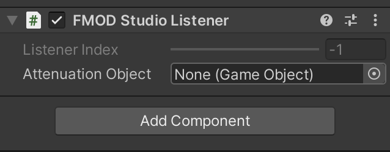

## FMOD API

### 1. Studio Listener

`StudioListener.cs`

3D 포지셔닝 사운드가 올바르게 패닝하려면 Studio Listener를 카메라 컴포넌트에 붙여야 한다.

[3D Attenuation Object](https://www.youtube.com/watch?v=czeBBnDG3z8) : 감쇠 오브젝트 즉, 감쇠가 발생되는 트리거를 변환 시킬 수 있다. 카메라가 아니라 사람으로. 탑다운 게임에서 사용될

---

* https://www.youtube.com/watch?v=GD-p6mbo5Z4

### 2. Studio Event Emitter

FMOD Studio Unity 통합은 주어진 세계 위치에서 FMOD Studio 이벤트를 재생하기 위한 간단한 이미터 구성 요소와 함께 제공됩니다.
