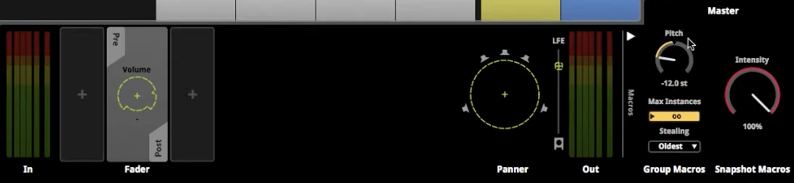

<details style="cursor:pointer">
<summary>접기/펼치기</summary>

<!-- summary 아래 한칸 공백 두어야함 -->
</details>

---

## 오디오 세팅
<details style="cursor:pointer">
<summary>접기/펼치기</summary>

<!-- summary 아래 한칸 공백 두어야함 -->

```cs
using System.Collections;
using System.Collections.Generic;
using UnityEngine;

public class AudioSettings : MonoBehaviour
{
    FMOD.Studio.EventInstance SFXVolumeTestEvent;

    FMOD.Studio.Bus Music;
    FMOD.Studio.Bus SFX;
    FMOD.Studio.Bus Master;
    float MusicVolume = 0.5f;
    float SFXVolume = 0.5f;
    float MasterVolume = 1f;

    private void Awake() {
        Music = FMODUnity.RuntimeManager.GetBus("");
        SFX = FMODUnity.RuntimeManager.GetBus("");
        Master = FMODUnity.RuntimeManager.GetBus("");
        SFXVolumeTestEvent = FMODUnity.RuntimeManager.CreateInstance("");
    }

    private void Update() {
        Music.setVolume(MusicVolume);
        SFX.setVolume(SFXVolume);
        Master.setVolume(MasterVolume);
        //Music.setPaused();
    }

    public void SFXVolumeLevel(float newSFXVolume){
        SFXVolume = newSFXVolume;
        FMOD.Studio.PLAYBACK_STATE PbStage;
        SFXVolumeTestEvent.getPlaybackState(out PbStage);
        if(PbStage != FMOD.Studio.PLAYBACK_STATE.PLAYING){
            SFXVolumeTestEvent.start();
        }
    }
}

```

</details>

---

## Beat Tracking

<details style="cursor:pointer">
<summary>접기/펼치기</summary>

<!-- summary 아래 한칸 공백 두어야함 -->
```cs
using System;
using System.Runtime.InteropServices;

// 콜백 데이터 가져오기
TimelineInfo timelineInfo = null;
GCHandle timelineHandle;

[StructLayout(LayoutKind.Sequential)]
public class TimelineInfo {
    public int currentBeat = 0;
    public FMOD.StringWrapper lastMarker = new FMOD.StringWrapper();
}

[AOT.MonoPInvokeCallback(typeof(FMOD.Studio.EVENT_CALLBACK))]
static FMOD.RESULT BeatEventCallback(FMOD.Studio.EVENT_CALLBACK type, IntPtr instancePtr, IntPtr parameterPtr){
    FMOD.Studio.EventInstance instance = new FMOD.Studio.EventInstance(instancePtr);

    IntPtr timelineInfoPtr;
    FMOD.RESULT result = instance.getUserData(out timelineInfoPtr);

    if(result != FMOD.RESULT.OK){
        Debug.LogError("Timeline Callback error : " + result);
    }
    else if(timelineInfoPtr != IntPtr.Zero){
        GCHandle timelineHandle = GCHandle.FromIntPtr(timelineInfoPtr);
        TimelineInfo timelineInfo = (TimelineInfo)timelineHandle.Target;

        switch(type){
            case FMOD.Studio.EVENT_CALLBACK_TYPE.TIMELINE_BEAT : 
                {

                }
                break;
            case FMOD.Studio.EVENT_CALLBACK_TYPE.TIMELINE_MARKER : 
                {

                }
                break;
        }
    }
    return FMOD.RESULT.OK;
}
```
</details>

---
## Footstep On Pad

<details style="cursor:pointer">
<summary>접기/펼치기</summary>

<!-- summary 아래 한칸 공백 두어야함 -->
```cs
using UnityEngine;

public class Footsteps : MonoBehaviour {
    [FMODUnity.EventRef]
    public string InputFootsteps;
    FMOD.Studio.EventInstance FootstepsEvent;
    FMOD.Studio.ParameterInstance WoodParameter;
    FMOD.Studio.ParameterInstance MetalParameter;
    FMOD.Studio.ParameterInstance GrassParameter;

    bool playerismoving;
    public float walkingspeed;
    private float woodValue;
    private float metalValue;
    private float grassValue;

    void Start(){
        FootstepsEvent = FMODUnity.RuntimeManager.CreateInstance(InputFootsteps);
        FootstepsEvent.getParameter("Wood", out WoodParameter);
        FootstepsEvent.getParameter("Metal", out MetalParameter);
        FootstepsEvent.getParameter("Grass", out GrassParameter);

        InvokeReapeating("CallFootsteps", 0, walkingspeed);
    }
    void Update(){
        WoodParameter.setValue(WoodValue);
        MetalParameter.setValue(MetalValue);
        GrassParameter.setValue(GrassValue);

        PlayerMove();
    }
    void CallFootsteps(){
        if(isMoveing){FootstepsEvent.start();}

    }
    void OnDisable(){playerismoving = false;}
    void OnTriggerStay(Collider MaterialCheck){
        float FadeSpeed = 10f;
        if(MaterialCheck.CompareTag("Wood:Material")){}
        if(MaterialCheck.CompareTag("Metal:Material")){}
        if(MaterialCheck.CompareTag("Grass:Material")){}
    }
}
```
</details>

---

## 3D SoundEvent

<details style="cursor:pointer">
<summary>접기/펼치기</summary>

<!-- summary 아래 한칸 공백 두어야함 -->
```cs
```
</details>

---

## 오클루젼 

---

## 스냅샷 & 불릿타임

이펙트값 감지

스냅샷도 일종의 이벤트 인스턴스다.
그리고 그 이벤트 인스턴스의 패러미터를 가져오는것으로 적용하면 도니다.

```cs
```

https://www.youtube.com/watch?v=HFUeymsbjQE&t=616s

---

## 리버브 존

https://www.youtube.com/watch?v=8IbWCP5FrjY

---

### 참고
* https://www.youtube.com/watch?v=xCTIdngHH3Y
* https://www.youtube.com/watch?v=X6DAGp7AyY4


